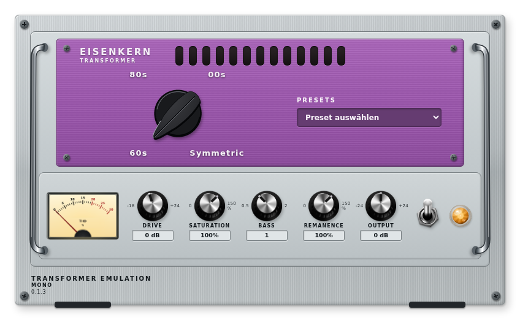
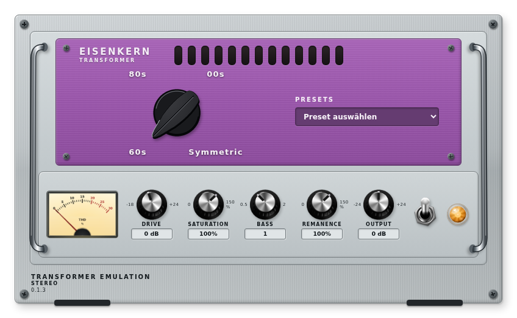

# Eisenkern — Standalone-Transformator (LV2 + JSFX)

Eigenständiges Transformator-Plugin für LV2 (Mono/Stereo, MOD Dwarf) und
JSFX (REAPER). Vier Profile — `60s`, `80s`, `00s`, `Symmetric` — sind
Factory-Presets; der Nutzer legt eigene Presets über den Host an. Der DSP
ist ein **reduziertes Gray-Box-Modell**: Die Funktionsstruktur (Fluss-Integrator,
Sättigungskennlinie, 14 Stop-Zweige, HF-Zweipol, lastgekoppeltes Netz) wurde
gegen einen Datenblatt-Fit (Jensen JT-11P-1-Referenz) abgestimmt — es besteht
**keine zertifizierte Hardwaregleichheit** und keine Revisionstreue aus
Literatur allein.

## Vorschau

| Mono | Stereo |
|---|---|
|  |  |

## Status (2026-10-09, 0.1.3)

Der Solver-Kern ist aus dem Geschwisterprojekt
[`mod-1175-lv2`](https://github.com/j4yj03/mod-1175-lv2)
(Green Stripe 76) **bitgleich übertragen und verifiziert**; Generator,
Plugin-Metadaten (LV2-TTL-Satz mit Port-Gruppen, Presets, JSFX-Wrappers,
RPL) und die **modgui** (kompakte Kopfplatte, Chicken-Head-Profilwähler,
natives Preset-Dropdown, vorbereitete THD-Anzeige) sind aufgebaut. Der
LV2-DSP-Wrapper (A2) und die EEL2-Engine (A3) folgen; die JSFX-Wrappers
sind bis dahin noch nicht ladbar. Danach übernimmt ein eigener Agent die
Weiterentwicklung.

- **Plan/Arbeitsschritte:** [`docs/TODO.md`](docs/TODO.md)
- **Arbeitsregeln für Agenten:** [`AGENTS.md`](AGENTS.md)
- **Projektstand/Übergabe:** [`docs/PROJEKT.md`](docs/PROJEKT.md)
- **Herkunft/Provenanz:** [`docs/QUELLEN.md`](docs/QUELLEN.md)
- **DSP-Verträge:** [`docs/DSP.md`](docs/DSP.md) (Aufbau)
- **Messplätze:** [`docs/MESSTECHNIK.md`](docs/MESSTECHNIK.md) (Aufbau)

## Umfang (Beschlüsse 2026-10-08)

| Punkt | Entscheidung |
|---|---|
| Name | **Eisenkern** (Kollisionscheck vor Release, siehe QUELLEN) |
| Modelle | 60s / 80s / 00s / Symmetric als Presets; **kein** None-Wert (Bypass macht der Host) |
| Drive | pur (skaliert `source_volts_per_fs`), eigener Output-Regler |
| Expert-Regler | nur in den Settings: Load, Source, HF-Kante, hf_q, Familie, Exponent |
| Stereo | zwei unabhängige Kanalkerne, kein Stereo-Link |
| Bank | eigene übertragene Kopie der Transformatorbank mit erhaltenem Herkunftsmanifest |
| Zielgerät | MOD Dwarf (OS 1.14 RC4 Teststand), 48 kHz, aarch64/Cortex-A35 |

Der Kompressor „Green Stripe 76" lebt im Geschwisterrepository; dort wird
die Transformatorstufe in einem eigenen Arbeitsblock entfernt (dessen
Presets verlieren dadurch ihre Trafofärbung — ausdrücklicher Benutzerauftrag).

## Lizenz

MIT — siehe [LICENSE](LICENSE). Die übernommenen Modellbank und der
Solver stammen aus `mod-1175-lv2` (ebenfalls MIT); Herkunft und SHA256 der
Quellen stehen in [`docs/QUELLEN.md`](docs/QUELLEN.md).
